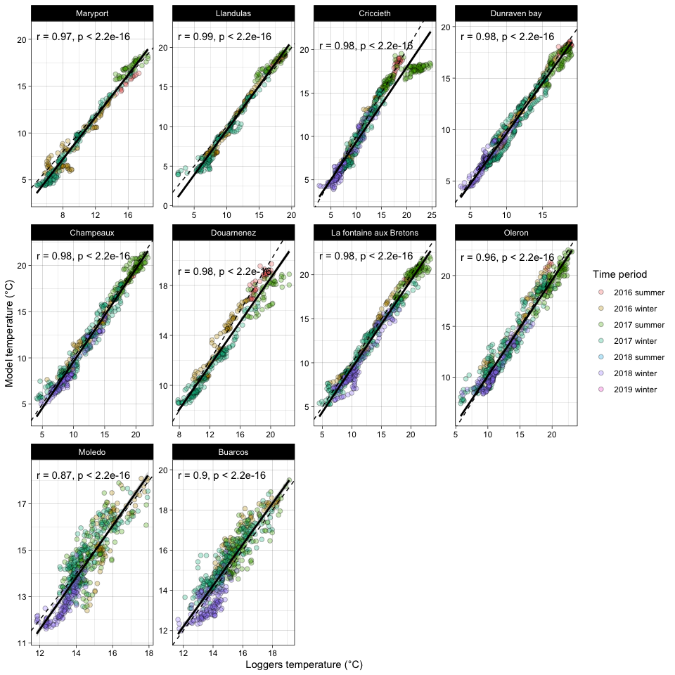
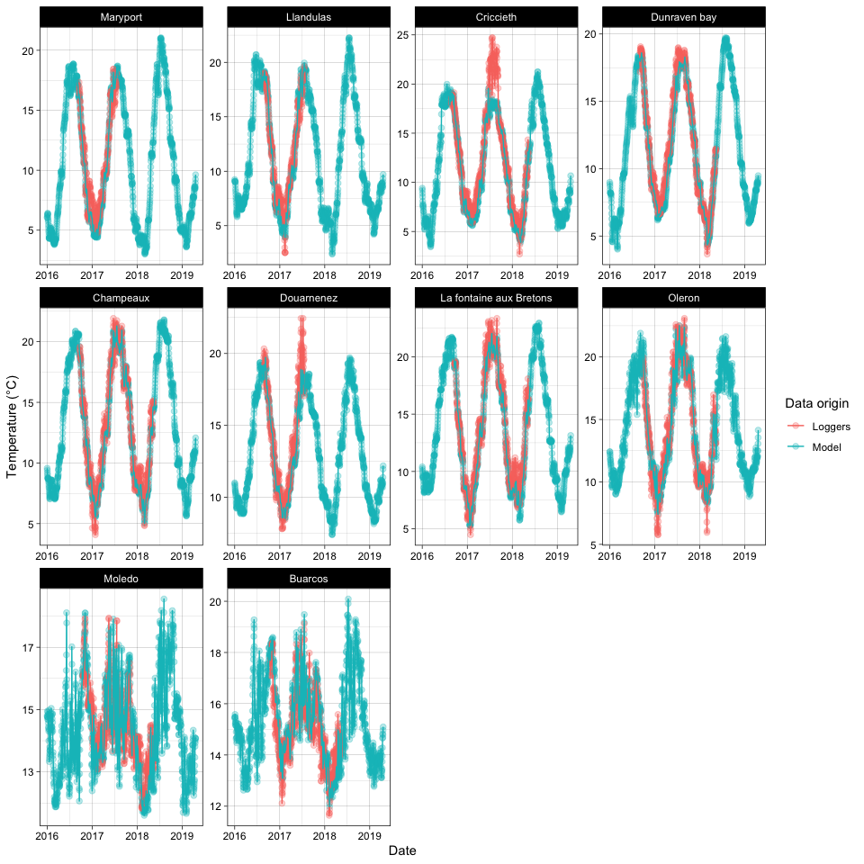

Validation of Copernicus and Arpege data with the in-situ loggers data
\[Amelia version\]
================
A. Boyé
14 novembre, 2019

# Packages

``` r
# Data handling
library(dplyr)
library(readr)
library(magrittr)
library(purrr)
library(tidyr)

# Representation
library(ggplot2)
library(viridis)
library(cowplot)
library(plotly)
library(gridExtra)
library(ggpubr)
library(ggforce)
```

-----

# Modification for Amelia’s supplementary material

  - \[X\] Remove LymeRegis and Castelejo
  - \[X\] Reduce the time period of the comparison
  - \[ \] Retrieve sensor data 1h before and after high or low tide ?

-----

# Load files

## Load models outputs

``` r
# Modèle IBI_ANALYSIS_FORECAST_PHYS_005_001
load("01_data/copern_phy.Rdata")

# Modèle Arpège
load("01_data/arpege.Rdata")
```

## Load T°C sensors data

``` r
# T°C sensors
sensors <- readRDS("01_data/imported_sabellaria_data.RDS")
```

-----

# Format the outputs of the models

``` r
copern_phy <- copern_phy %>%
  # Rename the variables with their full names
  mutate(variable_abbr = variable, variable = recode(variable,
    "bottomT" = "sea_water_temperature_at_sea_floor",
    "mlotst" = "ocean_mixed_layer_thickness",
    "so" = "sea_water_salinity",
    "thetao" = "sea_water_temperature",
    "uo" = "eastward_sea_water_velocity",
    "vo" = "northward_sea_water_velocity",
    "zos" = "sea_surface_height_above_geoid"
     )
  ) %>%
  # Order the sites according to the lattitudinal gradient
  mutate(site_name=factor(site_name,levels=c("Maryport","Llandulas","Criccieth","Dunraven bay","Lyme Regis","Champeaux","Douarnenez","La fontaine aux Bretons","Oleron","Moledo","Buarcos","Castelejo"),ordered=TRUE)) %>%
  # Remove Lyme Regis and Castelejo
  filter(!(site_name %in% c("Lyme Regis", "Castelejo"))) %>%
  # Keep only T°C data
  filter(variable_abbr %in% c("bottomT","thetao")) %>%
  select(-variable_abbr) %>%
  spread(variable,value)

arpege <- arpege %>% 
  # Order the sites according to the lattitudinal gradient
  mutate(site_name=factor(site_name,levels=c("Maryport","Llandulas","Criccieth","Dunraven bay","Lyme Regis","Champeaux","Douarnenez","La fontaine aux Bretons","Oleron","Moledo","Buarcos","Castelejo"),ordered=TRUE)) %>%
  # Remove Lyme Regis and Castelejo
  filter(!(site_name %in% c("Lyme Regis", "Castelejo"))) %>%
  # Convert the temperature from Kelvin to °C
  mutate(value = if_else(variable == "t2m", value - 273.15, value)) %>%
  # Keep only T°C data
  filter(variable == "t2m") %>%
  spread(variable,value) %>%
  rename("air_temperature" = "t2m") 
```

# Format loggers data

``` r
# Retrieve the data already averaged across the different loggers put in each site
loggers <- sensors$per_shore %>%
  # Keep only the temperature data
  select(site_name = loc, temp) %>%
  unnest(temp) %>%
  # Retrieve the date from the timestamp
  mutate(date = as.Date(time)) %>%
  # Change the name of the sites to match with the models outputs
  mutate(site_name=recode(site_name, "maryport" = "Maryport", "llanddulas" = "Llandulas", "criccieth" = "Criccieth", "dunraven" = "Dunraven bay", "lyme_regis" = "Lyme Regis", "champeaux" = "Champeaux", "douarnenez" = "Douarnenez", "pornic" = "La fontaine aux Bretons","oleron" = "Oleron", "moledo" = "Moledo","buarcos" = "Buarcos", "castelejo" = "Castelejo")) %>%
  # Order the sites according to the lattitudinal gradient
  mutate(site_name=factor(site_name,levels=c("Maryport","Llandulas","Criccieth","Dunraven bay","Lyme Regis","Champeaux","Douarnenez","La fontaine aux Bretons","Oleron","Moledo","Buarcos","Castelejo"),ordered=TRUE)) %>%
  # Remove Lyme Regis and Castelejo
  filter(!(site_name %in% c("Lyme Regis", "Castelejo"))) 

# Separate the T°C measured during emersion and immersion
#--------------------------------------------------------

# Immersion periods
loggers_im <- loggers %>%
  filter(height > 0)

# Emersion periods
loggers_em <- loggers %>%
  filter(height <= 0)

# Check that we get all the data with these two filters 
nrow(loggers) == (nrow(loggers_im) + nrow(loggers_em))
```

    ## [1] TRUE

``` r
## Separate the T°C measured during emersion and immersion
##--------------------------------------------------------
#
#get_time <- function(x,tide = c("lo","hi")){
#  
#  #Get the date of the low or high tide
#  out <- x %>%
#    filter(!! sym(tide) == TRUE) %>%
#    pull(time)
#  
#  # Retrieve one hour before and after the low/high tide
#  out <- c(out - 1* 3600, out , out + 1* 3600)
#  
#  return(out)
#}
#
## Emersion periods
##-----------------
#
## Get the values one hour before and one hour after low tides
#loggers_em <- loggers %>%
#  group_by(site_name) %>%
#  nest() %>%
#  mutate(data = map(data, ~ .x %>% filter(time %in% get_time(.x, tide = "lo")))) %>%
#  unnest(data)
#
## Immersion periods
##-------------------
#
## Get the values one hour before and one hour after high tides
#loggers_im <- loggers %>%
#  group_by(site_name) %>%
#  nest() %>%
#  mutate(data = map(data, ~ .x %>% filter(time %in% get_time(.x, tide = "hi")))) %>%
#  unnest(data)
#
## Check number of obs
##--------------------
#nrow(loggers_em)
#nrow(loggers_im)
```

-----

# Congruence between Copernicus and loggers data from immersion periods

## Format and select the data

``` r
# Format the loggers data
#------------------------

loggers_im <- loggers_im %>%
  # Average the loggers value per day
  group_by(site_name,date) %>%
  summarise(loggers_temperature_during_immersion = mean(temp)) %>%
  ungroup()

# Format the whole df for comparison
#------------------------------------

# Merge with the model outputs
comparison_im <- copern_phy %>%
  # Merge with sensors data
  full_join(., loggers_im) %>%
  # Format the dates
  mutate(year = format(date, "%Y"), month = as.numeric(format(date, "%m"))) %>%
  mutate(season = if_else(month %in% c(10,11,12,1,2,3,4,5), "winter", "summer")) %>%
  unite("period", c("year","season"), sep=" ") 

# Melt the data 
comparison_im_melted <- comparison_im %>% 
  select(site_name,date, period, sea_water_temperature,loggers_temperature_during_immersion) %>%
  gather(origin,temperature,-site_name, -date, -period) %>%
  mutate(origin = recode(origin, "sea_water_temperature" = "Model", "loggers_temperature_during_immersion" = "Loggers"))

# Select the period of Amelia's paper
#------------------------------------

# Select the data
comparison_im_sel <- comparison_im %>%
  # Keep only Amelia sampling period
  filter(period %in% c("2017 summer", "2017 winter", "2018 summer", "2018 winter"))

# Select the melted data
comparison_im_melted_sel <- comparison_im_melted %>%
  # Keep only Amelia sampling period
  filter(period %in% c("2017 summer", "2017 winter", "2018 summer", "2018 winter"))
```

## With all data available

``` r
# Correlation between thetao and loggers data at immersion
#---------------------------------------------------------
p <- ggplot(aes(x= loggers_temperature_during_immersion, y = sea_water_temperature, fill = period), data = comparison_im)
p <- p + facet_wrap(.~site_name, scales = "free", ncol = 4)
p <- p + geom_point(shape = 21, size = 2, alpha = 0.3)
p <- p + geom_abline(intercept = 0, slope = 1, linetype = "dashed", size = 0.5)
p <- p + geom_smooth(aes(x= loggers_temperature_during_immersion, y = sea_water_temperature), inherit.aes = FALSE, method = "lm", color = "black")
p <- p + stat_cor(aes(x= loggers_temperature_during_immersion, y = sea_water_temperature), method = "spearman", inherit.aes = FALSE)
p <- p + scale_fill_discrete(name = "Time period")
p <- p + xlab("Loggers temperature (°C)") + ylab("Model temperature (°C)")
p <- p + theme_linedraw() 

plot(p)
```

<!-- -->

``` r
# Representation of the time series for the two types of data
#------------------------------------------------------------
p <- ggplot(aes(x= date, y = temperature, col = origin), data = comparison_im_melted)
p <- p + facet_wrap(.~site_name, ncol = 4, scales = "free")
p <- p + geom_point(size = 2, alpha = 0.3)
p <- p + geom_line()
p <- p + scale_color_discrete(name = "Data origin")
p <- p + xlab("Date") + ylab("Temperature (°C)")
p <- p + theme_linedraw() 
p
```

<!-- -->

``` r
# Focus on Criccieth
p <- ggplot(aes(x= date, y = temperature, col = origin), data = subset(comparison_im_melted, site_name == "Criccieth"))
p <- p + geom_point(size = 2, alpha = 0.3)
p <- p + geom_line()
p <- p + facet_zoom(x = date > "2017-04-01" & date < "2017-12-01")
p <- p + scale_color_discrete(name = "Data origin")
p <- p + xlab("Date") + ylab("Temperature (°C)") + ggtitle("Criccieth")
p <- p + theme_linedraw() 
p
```

<!-- -->

``` r
# Focus on Douarnenez
p <- ggplot(aes(x= date, y = temperature, col = origin), data = subset(comparison_im_melted, site_name == "Douarnenez"))
p <- p + geom_point(size = 2, alpha = 0.3)
p <- p + geom_line()
p <- p + facet_zoom(x = date > "2017-04-01" & date < "2017-09-01")
p <- p + scale_color_discrete(name = "Data origin")
p <- p + xlab("Date") + ylab("Temperature (°C)") + ggtitle("Douarnenez")
p <- p + theme_linedraw() 
p
```

<!-- -->

## With only the periods considered in Amelia’s paper

``` r
# Correlation between thetao and loggers data at immersion
#---------------------------------------------------------
p <- ggplot(aes(x= loggers_temperature_during_immersion, y = sea_water_temperature, fill = period), data = comparison_im_sel)
p <- p + facet_wrap(.~site_name, scales = "free", ncol = 4)
p <- p + geom_point(shape = 21, size = 2, alpha = 0.3)
p <- p + geom_abline(intercept = 0, slope = 1, linetype = "dashed", size = 0.5)
p <- p + geom_smooth(aes(x= loggers_temperature_during_immersion, y = sea_water_temperature), inherit.aes = FALSE, method = "lm", color = "black")
p <- p + stat_cor(aes(x= loggers_temperature_during_immersion, y = sea_water_temperature), method = "spearman", inherit.aes = FALSE)
p <- p + scale_fill_discrete(name = "Time period")
p <- p + xlab("Loggers temperature (°C)") + ylab("Model temperature (°C)")
p <- p + theme_linedraw() 

plot(p)
```

<!-- -->

``` r
# Representation of the time series for the two types of data
#------------------------------------------------------------
p <- ggplot(aes(x= date, y = temperature, col = origin), data = comparison_im_melted_sel)
p <- p + facet_wrap(.~site_name, ncol = 4, scales = "free")
p <- p + geom_point(size = 2, alpha = 0.3)
p <- p + geom_line()
p <- p + scale_color_discrete(name = "Data origin")
p <- p + xlab("Date") + ylab("Temperature during immersion (°C)")
p <- p + theme_linedraw() 
p
```

<!-- -->

-----

# Congruence between Arpege and loggers data from emmersion periods

## Format and select the data

``` r
# Format hourly outputs for comparison of air vs emerged loggers T°C
#-------------------------------------------------------------------

# Retrieve the data already averaged across the different loggers put in each site
loggers_em_h <- loggers_em %>%
  # Here we keep data at the scale of an hour as we also have hourly data in arpege
  rename("loggers_temperature_during_emersion" = "temp")

# Merge with the model outputs
comparison_em_h <- arpege %>%
  # Merge with sensors data
  full_join(., loggers_em_h) %>%
  # Format the dates
  mutate(year = format(time, "%Y"), month = as.numeric(format(time, "%m"))) %>%
  mutate(season = if_else(month %in% c(10,11,12,1,2,3,4,5), "winter", "summer")) %>%
  unite("period", c("year","season"), sep=" ")

# Melt the data
comparison_em_h_melted <- comparison_em_h %>% 
  select(site_name,time, period, air_temperature,loggers_temperature_during_emersion) %>%
  gather(origin,temperature,-site_name, -time, -period) %>%
  mutate(origin = recode(origin, "air_temperature" = "Model", "loggers_temperature_during_emersion" = "Loggers"))

# Format DAILY outputs for comparison of air vs emerged loggers T°C
#-------------------------------------------------------------------

# Retrieve the data already averaged across the different loggers put in each site
loggers_em_d <- loggers_em %>%
  # Average the loggers values per day
  group_by(site_name,date) %>%
  summarise(loggers_temperature_during_emersion = mean(temp)) %>%
  ungroup()

# Merge with the model outputs
comparison_em_d <- comparison_em_h %>%
  mutate(date = as.Date(time)) %>%
  # Average the loggers values per day
  group_by(site_name,date, period) %>%
  summarise(
    loggers_temperature_during_emersion = mean(loggers_temperature_during_emersion, na.rm = TRUE), 
    air_temperature = mean(air_temperature, na.rm = TRUE)
    ) %>%
  ungroup()

# Melt the data
comparison_em_d_melted <- comparison_em_d %>% 
  select(site_name,date, period, air_temperature,loggers_temperature_during_emersion) %>%
  gather(origin,temperature,-site_name, -date, -period) %>%
  mutate(origin = recode(origin, "air_temperature" = "Model", "loggers_temperature_during_emersion" = "Loggers"))

# Select the period of Amelia's paper
#------------------------------------

# Hourly
#-------

# Select the data
comparison_em_h_sel <- comparison_em_h %>%
  # Keep only Amelia sampling period
  filter(period %in% c("2017 summer", "2017 winter", "2018 summer", "2018 winter"))

# Select the melted data
comparison_em_h_melted_sel <- comparison_em_h_melted %>%
  # Keep only Amelia sampling period
  filter(period %in% c("2017 summer", "2017 winter", "2018 summer", "2018 winter"))


# Daily
#------

# Select the data
comparison_em_d_sel <- comparison_em_d %>%
  # Keep only Amelia sampling period
  filter(period %in% c("2017 summer", "2017 winter", "2018 summer", "2018 winter"))

# Select the melted data
comparison_em_d_melted_sel <- comparison_em_d_melted %>%
  # Keep only Amelia sampling period
  filter(period %in% c("2017 summer", "2017 winter", "2018 summer", "2018 winter"))
```

## With all data available

### Hourly

``` r
# Correlation between thetao and loggers data at immersion
#---------------------------------------------------------
p <- ggplot(aes(x= loggers_temperature_during_emersion, y = air_temperature, fill = period), data = comparison_em_h)
p <- p + facet_wrap(.~site_name, ncol = 4, scales = "free")
p <- p + geom_point(shape = 21, size = 2, alpha = 0.3)
p <- p + geom_abline(intercept = 0, slope = 1, linetype = "dashed", size = 0.5)
p <- p + geom_smooth(aes(x= loggers_temperature_during_emersion, y = air_temperature), inherit.aes = FALSE, method = "lm")
p <- p + stat_cor(aes(x= loggers_temperature_during_emersion, y = air_temperature), method = "spearman", inherit.aes = FALSE)
p <- p + scale_fill_discrete(name = "Time period")
p <- p + xlab("Loggers temperature (°C)") + ylab("Model temperature (°C)")
p <- p + theme_linedraw() 

plot(p)
```

<!-- -->

``` r
# Representation of the time series for the two types of data
#-------------------------------------------------------------
p <- ggplot(aes(x= time, y = temperature, col = origin), data = comparison_em_h_melted)
p <- p + facet_wrap(.~site_name, ncol = 4, scales = "free")
p <- p + geom_point(size = 2, alpha = 0.3)
p <- p + geom_line()
p <- p + scale_color_discrete(name = "Data origin")
p <- p + xlab("Time") + ylab("Temperature during emersion (°C)")
p <- p + theme_linedraw() 
p
```

<!-- -->

### Daily (by averaging per day)

``` r
# Correlation between thetao and loggers data at immersion
#---------------------------------------------------------
p <- ggplot(aes(x= loggers_temperature_during_emersion, y = air_temperature, fill = period), data = comparison_em_d)
p <- p + facet_wrap(.~site_name, ncol = 4, scales = "free")
p <- p + geom_point(shape = 21, size = 2, alpha = 0.3)
p <- p + geom_abline(intercept = 0, slope = 1, linetype = "dashed", size = 0.5)
p <- p + geom_smooth(aes(x= loggers_temperature_during_emersion, y = air_temperature), inherit.aes = FALSE, method = "lm")
p <- p + stat_cor(aes(x= loggers_temperature_during_emersion, y = air_temperature), method = "spearman", inherit.aes = FALSE)
p <- p + scale_fill_discrete(name = "Time period")
p <- p + xlab("Loggers temperature (°C)") + ylab("Model temperature (°C)")
p <- p + theme_linedraw() 

plot(p)
```

<!-- -->

``` r
# Representation of the time series for the two types of data
#-------------------------------------------------------------
p <- ggplot(aes(x= date, y = temperature, col = origin), data = comparison_em_d_melted)
p <- p + facet_wrap(.~site_name, ncol = 4, scales = "free")
p <- p + geom_point(size = 2, alpha = 0.3)
p <- p + geom_line()
p <- p + scale_color_discrete(name = "Data origin")
p <- p + xlab("Date") + ylab("Temperature during emersion (°C)")
p <- p + theme_linedraw() 
p
```

<!-- -->

## With only the periods considered in Amelia’s paper

### Hourly

``` r
# Correlation between thetao and loggers data at immersion
#---------------------------------------------------------
p <- ggplot(aes(x= loggers_temperature_during_emersion, y = air_temperature, fill = period), data = comparison_em_h_sel)
p <- p + facet_wrap(.~site_name, ncol = 4, scales = "free")
p <- p + geom_point(shape = 21, size = 2, alpha = 0.3)
p <- p + geom_abline(intercept = 0, slope = 1, linetype = "dashed", size = 0.5)
p <- p + geom_smooth(aes(x= loggers_temperature_during_emersion, y = air_temperature), inherit.aes = FALSE, method = "lm")
p <- p + stat_cor(aes(x= loggers_temperature_during_emersion, y = air_temperature), method = "spearman", inherit.aes = FALSE)
p <- p + scale_fill_discrete(name = "Time period")
p <- p + xlab("Loggers temperature (°C)") + ylab("Model temperature (°C)")
p <- p + theme_linedraw() 

plot(p)
```

<!-- -->

``` r
# Representation of the time series for the two types of data
#-------------------------------------------------------------
p <- ggplot(aes(x= time, y = temperature, col = origin), data = comparison_em_h_melted_sel)
p <- p + facet_wrap(.~site_name, ncol = 4, scales = "free")
p <- p + geom_point(size = 2, alpha = 0.3)
p <- p + geom_line()
p <- p + scale_color_discrete(name = "Data origin")
p <- p + xlab("Time") + ylab("Temperature during emersion (°C)")
p <- p + theme_linedraw() 
p
```

<!-- -->

### Daily (by averaging per day)

``` r
# Correlation between thetao and loggers data at immersion
#---------------------------------------------------------
p <- ggplot(aes(x= loggers_temperature_during_emersion, y = air_temperature, fill = period), data = comparison_em_d_sel)
p <- p + facet_wrap(.~site_name, ncol = 4, scales = "free")
p <- p + geom_point(shape = 21, size = 2, alpha = 0.3)
p <- p + geom_abline(intercept = 0, slope = 1, linetype = "dashed", size = 0.5)
p <- p + geom_smooth(aes(x= loggers_temperature_during_emersion, y = air_temperature), inherit.aes = FALSE, method = "lm")
p <- p + stat_cor(aes(x= loggers_temperature_during_emersion, y = air_temperature), method = "spearman", inherit.aes = FALSE)
p <- p + scale_fill_discrete(name = "Time period")
p <- p + xlab("Loggers temperature (°C)") + ylab("Model temperature (°C)")
p <- p + theme_linedraw() 

plot(p)
```

<!-- -->

``` r
# Representation of the time series for the two types of data
#-------------------------------------------------------------
p <- ggplot(aes(x= date, y = temperature, col = origin), data = comparison_em_d_melted_sel)
p <- p + facet_wrap(.~site_name, ncol = 4, scales = "free")
p <- p + geom_point(size = 2, alpha = 0.3)
p <- p + geom_line()
p <- p + scale_color_discrete(name = "Data origin")
p <- p + xlab("Date") + ylab("Temperature during emersion (°C)")
p <- p + theme_linedraw() 
p
```

<!-- -->

-----

# Figure supplementary

## 1st representation

``` r
# Merge immersion and emersion comparison
#----------------------------------------
im_sel <- comparison_im_sel %>%
  select(site_name, sampling_period = period, date, loggers_temp = loggers_temperature_during_immersion, model_temp = sea_water_temperature) %>%
  mutate(tidal_period = "Immersion")

em_sel <- comparison_em_d_sel %>%
  select(site_name, sampling_period = period, date, loggers_temp = loggers_temperature_during_emersion, model_temp = air_temperature) %>%
  mutate(tidal_period = "Emersion")

comparison <- bind_rows(im_sel, em_sel)

# Correlation between model and loggers data
#-------------------------------------------
p <- ggplot(aes(x= loggers_temp, y = model_temp, fill = site_name), data = comparison)
p <- p + facet_wrap(.~tidal_period, ncol = 4)
p <- p + geom_point(shape = 21, size = 2, alpha = 0.3)
p <- p + geom_abline(intercept = 0, slope = 1, linetype = "dashed", size = 0.5)
p <- p + geom_smooth(aes(x= loggers_temp, y = model_temp), inherit.aes = FALSE, method = "lm", col = "black")
p <- p + stat_cor(aes(x= loggers_temp, y = model_temp), method = "spearman", inherit.aes = FALSE)
p <- p + scale_fill_manual(values = c("#7f3b08", "#b35806", "#e08214", "#fdb863", "#fee0b6", "#d8daeb", "#b2abd2", "#8073ac", "#542788", "#2d004b"), 
name = "Site", guide = guide_legend(override.aes = list(size = 4, alpha = 1)))
p <- p + xlab("Loggers temperature (°C)") + ylab("Model temperature (°C)")
p <- p + theme_linedraw() + coord_equal()

plot(p)
```

<!-- -->

## 2nd version

``` r
p <- ggplot(aes(x= loggers_temp, y = model_temp, fill = tidal_period), data = comparison)
p <- p + facet_wrap(.~site_name, ncol = 4, scales = "free")
p <- p + geom_point(shape = 21, size = 2, alpha = 0.3)
p <- p + geom_abline(intercept = 0, slope = 1, linetype = "dashed", size = 0.5)
p <- p + geom_smooth(aes(col = tidal_period),method = "lm")
p <- p + stat_cor(aes(col = tidal_period),method = "spearman")
p <- p + scale_fill_manual(values = c("#ca0020", "#0571b0"), 
name = "Tidal period", guide = guide_legend(override.aes = list(linetype = NULL, label = NULL,  shape = 21,size = 4, alpha = 1)))
p <- p + scale_color_manual(values = c("#ca0020", "#0571b0"), 
name = "Tidal period", guide = guide_legend(override.aes = list(linetype = NULL, label = NULL,  shape = 21,size = 4, alpha = 1)))
p <- p + xlab("Loggers temperature (°C)") + ylab("Model temperature (°C)")
p <- p + theme_linedraw() 

plot(p)
```

<!-- -->

## Alternative representations

``` r
library(ggpointdensity)

p <- ggplot(aes(x= loggers_temp, y = model_temp), data = comparison)
p <- p + facet_wrap(.~tidal_period, ncol = 4, scales = "free")
p <- p + geom_pointdensity(size = 2)
p <- p + scale_color_viridis()
p <- p + geom_abline(intercept = 0, slope = 1, linetype = "dashed", size = 0.5)
p <- p + geom_smooth(aes(x= loggers_temp, y = model_temp), inherit.aes = FALSE, method = "lm", col = "black")
p <- p + stat_cor(aes(x= loggers_temp, y = model_temp), method = "spearman", inherit.aes = FALSE)
p <- p + xlab("Loggers temperature (°C)") + ylab("Model temperature (°C)")
p <- p + theme_linedraw() 

plot(p)
```

    ## Warning: Removed 6438 rows containing non-finite values
    ## (stat_pointdensity).

    ## Warning: Removed 6438 rows containing non-finite values (stat_smooth).

    ## Warning: Removed 6438 rows containing non-finite values (stat_cor).

<!-- -->

-----

# Session info

``` r
sessionInfo()
```

    ## R version 3.5.0 (2018-04-23)
    ## Platform: x86_64-apple-darwin15.6.0 (64-bit)
    ## Running under: macOS  10.14.6
    ## 
    ## Matrix products: default
    ## BLAS: /Library/Frameworks/R.framework/Versions/3.5/Resources/lib/libRblas.0.dylib
    ## LAPACK: /Library/Frameworks/R.framework/Versions/3.5/Resources/lib/libRlapack.dylib
    ## 
    ## locale:
    ## [1] fr_FR.UTF-8/fr_FR.UTF-8/fr_FR.UTF-8/C/fr_FR.UTF-8/fr_FR.UTF-8
    ## 
    ## attached base packages:
    ## [1] stats     graphics  grDevices utils     datasets  methods   base     
    ## 
    ## other attached packages:
    ##  [1] ggpointdensity_0.1.0 ggforce_0.3.1        ggpubr_0.1.7        
    ##  [4] gridExtra_2.3        plotly_4.9.0         cowplot_0.9.2       
    ##  [7] viridis_0.5.1        viridisLite_0.3.0    ggplot2_3.2.1       
    ## [10] tidyr_1.0.0          purrr_0.3.2          magrittr_1.5        
    ## [13] readr_1.1.1          dplyr_0.8.3         
    ## 
    ## loaded via a namespace (and not attached):
    ##  [1] Rcpp_1.0.2        pillar_1.4.2      compiler_3.5.0   
    ##  [4] tools_3.5.0       zeallot_0.1.0     digest_0.6.20    
    ##  [7] jsonlite_1.6      evaluate_0.14     tibble_2.1.3     
    ## [10] lifecycle_0.1.0   gtable_0.3.0      pkgconfig_2.0.2  
    ## [13] rlang_0.4.0       yaml_2.2.0        xfun_0.9         
    ## [16] httr_1.4.1        withr_2.1.2       stringr_1.4.0    
    ## [19] knitr_1.24        htmlwidgets_1.3   vctrs_0.2.0      
    ## [22] hms_0.4.2         grid_3.5.0        tidyselect_0.2.5 
    ## [25] data.table_1.12.2 glue_1.3.1        R6_2.4.0         
    ## [28] rmarkdown_1.15    polyclip_1.10-0   farver_1.1.0     
    ## [31] tweenr_1.0.1      ellipsis_0.2.0.1  MASS_7.3-51.4    
    ## [34] backports_1.1.4   scales_1.0.0      htmltools_0.3.6  
    ## [37] assertthat_0.2.1  colorspace_1.4-1  labeling_0.3     
    ## [40] stringi_1.4.3     lazyeval_0.2.2    munsell_0.5.0    
    ## [43] crayon_1.3.4
